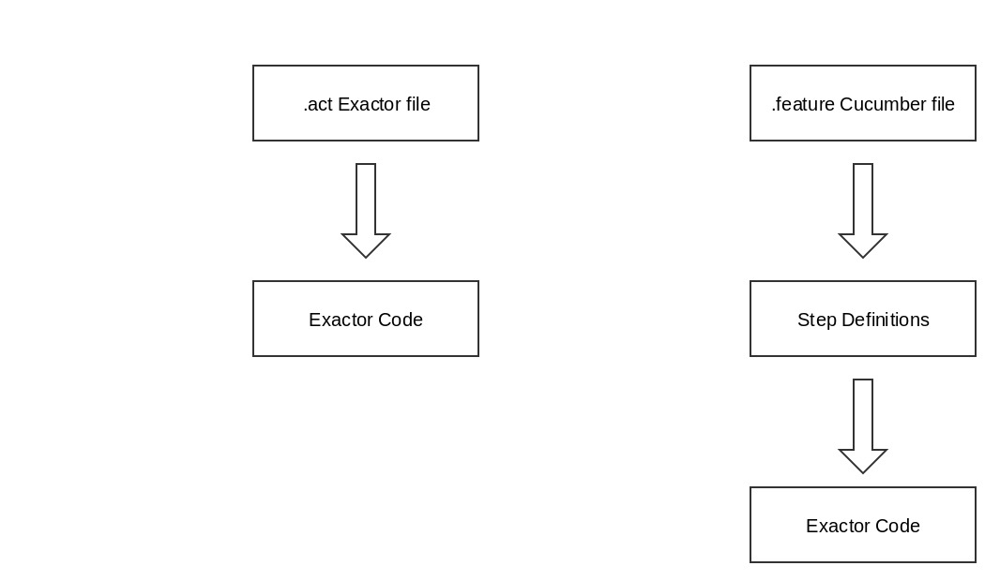

# Exactor To Cucumber - Machine Translation

## Description
Converts BBD style Acceptance tests written in the Exactor Framework, to equivalent written in the [Cucumber](https://cucumber.io/) Test Framework:

Works on a per module basis and should result in fully IDE-executable Cucumber tests once complete.


## Usage
To run this plugin, first run the following command within this project to add it to your local gradle installation: 

```
./gradlew install
```

Then add the following task definition to the `build.gradle` of the module you want to convert:

```
task exactorToCucumber (type:JavaExec) {
    main = "org.synchronoss.test.utils.cucumber.CucumberConverter"
    classpath = sourceSets.test.runtimeClasspath
    systemProperty "ARTIFACT", projectDir.absolutePath
    dependencies.add("runtime", "org.synchronoss.test.utils:exactor-to-cucumber:1.0-DEV")
}
```

Execute on the command line via:

```
./gradlew exactorToCucumber
```

Once the execution has completed successfully, the above task can be removed from the `build.gradle`

##Exactor vs Cucumber


This diagram demonstrates the difference in the way the two test frameworks are run. 


Exactor tests, which look like the following, call each class written on the left hand side and set any variable declared on the right hand side with the given values. 

```
Description "SAL-740 Add Arabic metadata, ensure it can be loaded"
Given
    ARunningServer
    ASalClient
When
    ClientStoresFile                    withPath="/objects/arabic.jpg"   settingVariable="key" purgeFirst="true"
    ClientUpdatesOrAddsMetaData         forKey="${key}" withValues="\\uFED6\\uFEDE=\\uFEC4\\uFEC5"
    ClientUpdatesOrAddsMetaData         forKey="${key}" withValues="\\uFEB5\\u066D=\\u0676\\u0061"
When
    VerifyMetaData                      forKey="${key}" hasValues="\\uFED6\\uFEDE=\\uFEC4\\uFEC5\n\\uFEB5\\u066D=\\u0676\\u0061"
```


In Feature Files, which look like the following, each line calls a Java method called a "step definition", which takes in the values in the feature file and applies them to the appropriate parameters.

```
Feature: AddAndLoadArabicMetadata
  Scenario:  "SAL-740 Add Arabic metadata, ensure it can be loaded"
    Given A Running Server
    Given A Sal Client
    When Client Stores File purge First=true setting Variable=key with Path=/objects/arabic.jpg
    When Client Updates Or Adds Meta Data for Key=${key} with Values=\\uFED6\\uFEDE=\\uFEC4\\uFEC5
    When Client Updates Or Adds Meta Data for Key=${key} with Values=\\uFEB5\\u066D=\\u0676\\u0061
    When Verify Meta Data for Key=${key} has Values=\\uFED6\\uFEDE=\\uFEC4\\uFEC5\n\\uFEB5\\u066D=\\u0676\\u0061
```

An example of a Java step definition: 

```
@Given("A Running Server$")
public void ARunningServer() throws Exception {
    ARunningServer object = new ARunningServer();
    object.setScript(CucumberGlobalContext.script);
    object.execute();
}
```

## Errors

Whenever an error in converting one of the exactor files occur, the converter should through a Runtime Error telling you which exactor test 
and which line in said exactor file threw the exception. The exception is in the form:

```
Exception in thread "main" java.lang.RuntimeException: unable to process file <filename> 
    at ...
Caused by: java.lang.RuntimeException: unable to process <fileline>
    at....
```

### Uneven quotation marks

If this additional exception is thrown:
```
Caused by: java.lang.RuntimeException: Line contains uneven number of quotation marks
```

It means that the exactor test is being converted is syntactically incorrect, and contains
an uneven number of quotation marks. This is fixed by modifying the exactor file and running the
converter again. 

### Inconsistent method naming

If the exception is thrown when the converter is searching for a method,then it is probably because
the method is named something different from the rest of the setter methods i.e. Not in the form
"setVariableName". If this is the case, the error is then fixed by changing the methods name so that
it follows the standard.

